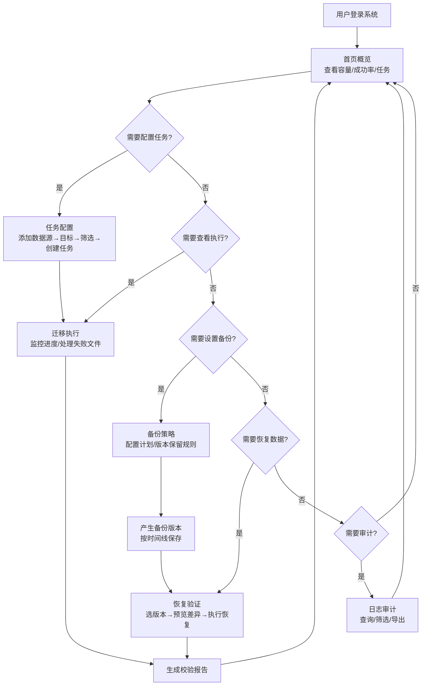

# 数据迁移与备份工具 - 产品需求文档 (PRD)

## 1. 产品概述

面向中小企业运维人员的数据迁移与备份管理平台，统一管理分散在服务器、网盘和业务系统中的重要文件，提供可视化的迁移、定时备份和可追溯恢复能力。帮助缺乏专职技术团队的企业稳定管理资料流转，降低数据丢失风险。

- **核心目标**：简化多源数据统一管理流程，提供自动化备份与可靠恢复机制
- **目标用户**：中小企业 IT 运维人员、行政管理人员
- **核心价值**：降低运维复杂度、提高数据安全性、操作可追溯

---

## 2. 核心功能

### 2.1 用户角色

| 角色 | 说明 | 核心权限 |
|------|------|----------|
| 运维管理员 | 默认角色，系统使用者 | 全部功能：数据源管理、任务配置、迁移执行、备份策略设置、恢复验证、日志查询 |

### 2.2 功能模块

1. **首页概览**：容量统计、成功率仪表盘、最近任务列表、失败任务提醒、站内通知
2. **任务配置**：数据源管理、目标位置配置、筛选规则设置、迁移任务创建
3. **迁移执行**：任务进度监控、速度显示、失败文件重试、错误原因列表
4. **备份策略**：备份计划配置（每日/每周）、版本时间线、自动保留策略
5. **恢复验证**：版本选择、差异预览、单文件/批量恢复、校验结果生成
6. **日志审计**：操作日志查询、按操作者筛选、任务异常记录、导出功能

### 2.3 页面详情

| 页面名称 | 模块名称 | 功能描述 |
|----------|----------|----------|
| 首页概览 | 容量统计卡片 | 显示已用存储、总容量、源文件数量、备份文件数量 |
| 首页概览 | 成功率仪表盘 | 环形进度图展示迁移成功率、备份完成率 |
| 首页概览 | 最近任务列表 | 展示最近7天的迁移/备份任务，含状态、时间、操作人 |
| 首页概览 | 失败任务提醒 | 列出最近失败任务，支持快速跳转到执行页重试 |
| 首页概览 | 站内通知中心 | 异常告警、任务完成通知、系统消息，支持已读标记 |
| 任务配置 | 数据源管理 | 新增/编辑/删除数据源，支持服务器FTP、网盘API、本地目录，标注用途标签 |
| 任务配置 | 目标位置配置 | 选择存储目标，配置目录命名规则（日期/任务名/自定义） |
| 任务配置 | 筛选规则设置 | 按文件类型（文档/图片/视频/压缩包）、更新时间范围、文件大小筛选 |
| 任务配置 | 迁移任务创建 | 创建一次性迁移任务，配置优先级、失败重试次数、通知方式 |
| 迁移执行 | 任务进度监控 | 实时进度条、文件总数/已完成/失败数统计 |
| 迁移执行 | 速度显示面板 | 实时传输速度（MB/s）、预计剩余时间、已传输大小 |
| 迁移执行 | 失败文件管理 | 失败文件列表，显示错误原因（网络/权限/格式），支持单条或批量重试 |
| 迁移执行 | 任务控制 | 暂停/继续/取消任务，查看任务详情日志 |
| 备份策略 | 计划配置 | 设置每日/每周备份时间，选择备份数据源和目标 |
| 备份策略 | 版本时间线 | 按时间轴展示备份历史版本，标记版本标签（完整/增量） |
| 备份策略 | 保留策略 | 配置版本保留数量、自动清理规则、存储空间告警阈值 |
| 恢复验证 | 版本选择 | 从时间线选择备份版本，查看版本内文件清单 |
| 恢复验证 | 差异预览 | 选中两个版本对比，高亮新增/修改/删除文件 |
| 恢复验证 | 恢复操作 | 单文件恢复、批量恢复、整版本恢复，选择恢复目标位置 |
| 恢复验证 | 校验结果 | 迁移/恢复前后 MD5/SHA 校验报告，可导出 CSV |
| 日志审计 | 操作日志查询 | 按时间范围、操作者、操作类型搜索日志 |
| 日志审计 | 日志详情 | 查看操作详情、参数变更记录、操作IP地址 |
| 日志审计 | 异常记录 | 任务异常栈追踪、告警级别、处理状态标记 |
| 日志审计 | 导出功能 | 支持按筛选条件导出 CSV/PDF 审计报告 |

---

## 3. 核心流程

### 3.1 主用户流程描述

运维人员登录系统后，首先在首页查看整体运行状态（容量、成功率、最近任务）。若发现异常任务，可直接进入执行页处理。日常工作流为：先在任务配置页添加数据源和目标位置，设置筛选规则后创建迁移任务；在迁移执行页监控任务进度，处理失败文件；通过备份策略页设置定时计划，产生的版本在恢复验证页可进行差异对比和恢复操作；所有操作记录均可在日志审计页查询追溯。

### 3.2 主流程图

---

## 4. 用户界面设计

### 4.1 设计风格

**整体定位**：专业务实的企业级运维管理工具，强调信息密度和操作效率，避免过度装饰。

- **主色调**：深海蓝 `#1e3a5f` - 传达专业、可靠、安全的视觉感受
- **辅助色**：
  - 成功绿 `#10b981` - 任务成功、通过校验
  - 警示橙 `#f59e0b` - 进行中、警告
  - 危险红 `#ef4444` - 失败、异常
  - 信息蓝 `#3b82f6` - 信息提示、链接
- **中性色**：以 slate 灰色系为基础，`#f8fafc` 背景、`#1e293b` 主文字、`#64748b` 次文字
- **按钮样式**：直角微圆角（rounded-md），实心按钮带微妙阴影，悬停时略加深
- **字体方案**：
  - 标题/数字：JetBrains Mono - 等宽字体增强数字可读性，体现技术感
  - 正文/标签：Noto Sans SC - 中文显示友好，清晰易读
- **布局风格**：左侧导航栏 + 顶部状态栏 + 内容区域的经典管理后台布局，卡片式信息分组
- **图标风格**：lucide-react 线性图标，16px/20px 两种尺寸，与文字基线对齐
- **动效原则**：克制实用，仅用于状态反馈（进度条、加载、hover），避免装饰性动画

### 4.2 页面设计概览

| 页面名称 | 模块名称 | UI 元素设计 |
|----------|----------|-------------|
| 首页概览 | 整体布局 | 2x2 统计卡片 + 下方左右分栏（左任务列表 60% / 右通知中心 40%） |
| 首页概览 | 统计卡片 | 大号等宽数字 + 趋势小箭头 + 底部说明文字，卡片左上角小图标点缀 |
| 首页概览 | 仪表盘 | SVG 环形进度图，中心显示百分比，下方文字说明 |
| 首页概览 | 任务列表 | 表格样式，状态标签带颜色圆点，操作列悬浮显示按钮 |
| 任务配置 | 整体布局 | 顶部步骤指示器（4步）+ 下方表单区 + 底部固定操作栏 |
| 任务配置 | 数据源卡片 | 图标 + 名称 + 用途标签 + 连接状态指示灯，选中态边框高亮 |
| 任务配置 | 筛选规则 | 文件类型用多选按钮组，时间范围用日期选择器，大小用滑块 |
| 迁移执行 | 整体布局 | 顶部任务信息卡 + 中部进度区 + 下方失败文件表格 |
| 迁移执行 | 进度面板 | 主进度条（粗）+ 分类型子进度条（细）+ 速度/时间统计网格 |
| 迁移执行 | 失败表格 | 每行含：文件名、大小、错误类型、重试次数、操作按钮 |
| 备份策略 | 时间线 | 垂直时间轴，节点为圆点，节点颜色区分备份类型，右侧为版本卡片 |
| 备份策略 | 计划表单 | 周几选择器用按钮组，时间用时间输入框，开关控制启用状态 |
| 恢复验证 | 差异预览 | 三列布局：旧版文件 / 差异标识（+/-/~） / 新版文件，行背景色区分 |
| 恢复验证 | 校验报告 | 左右对照布局，每个文件一行显示源/目标校验码及匹配状态 |
| 日志审计 | 过滤器 | 顶部筛选栏：日期范围 + 操作者下拉 + 操作类型多选 + 搜索框 |
| 日志审计 | 日志列表 | 斑马纹表格，时间左对齐，操作者带头像圆圈，详情可展开 |

### 4.3 响应式设计

- **设计优先级**：桌面端优先（默认 1440px），适配 1024px 以上屏幕
- **平板（1024px-768px）**：左侧导航栏折叠为图标模式，统计卡片改为 2x2 竖排
- **移动（<768px）**：导航转为底部标签栏，表格改为卡片列表形式，操作按钮堆叠
- **关键断点**：1280px（xl）、1024px（lg）、768px（md）
- **触控优化**：移动端按钮最小高度 44px，表格支持横向滑动

---

## 5. 非功能需求

### 5.1 性能要求
- 首屏加载 < 2s，页面切换 < 300ms
- 支持展示 10,000+ 条文件记录（虚拟滚动）
- 图表渲染流畅，无明显卡顿

### 5.2 易用性要求
- 关键操作 3 步内完成
- 表单提供合理默认值，减少用户输入
- 重要操作有二次确认提示

### 5.3 可访问性
- 语义化 HTML 标签
- 色彩对比度符合 WCAG AA 标准
- 支持键盘导航操作
