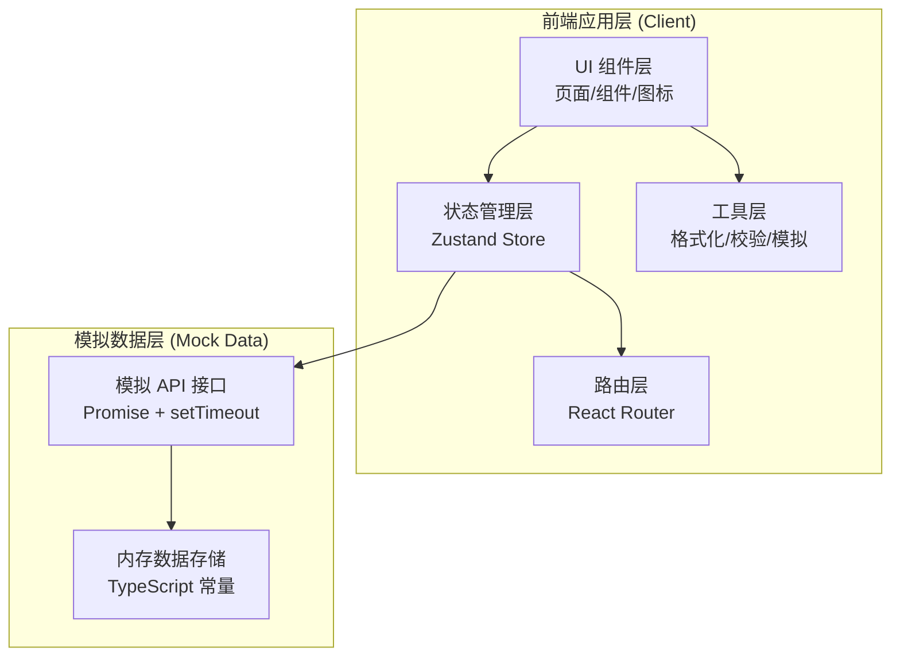

# 数据迁移与备份工具 - 技术架构文档

## 1. 架构设计

### 1.1 系统分层架构图



### 1.2 技术选型说明

本项目为纯前端演示应用，使用模拟数据实现完整功能演示，无需真实后端服务。

---

## 2. 技术描述

### 2.1 核心技术栈

| 类别 | 技术选型 | 版本 | 说明 |
|------|----------|------|------|
| 构建工具 | Vite | 5.x | 快速开发构建，HMR 支持 |
| 前端框架 | React | 18.x | 组件化开发，函数组件 + Hooks |
| 语言 | TypeScript | 5.x | 类型安全，提升可维护性 |
| 样式方案 | Tailwind CSS | 3.x | 原子化 CSS，快速构建 UI |
| 状态管理 | Zustand | 4.x | 轻量级状态管理，简单易用 |
| 路由管理 | React Router DOM | 6.x | 声明式路由，支持嵌套路由 |
| 图标库 | lucide-react | 0.344.x | 线性 SVG 图标，轻量美观 |
| 字体 | Google Fonts | - | JetBrains Mono + Noto Sans SC |

### 2.2 初始化方式

使用 vite-init 脚手架初始化 React + TypeScript 项目模板（react-ts），内置 tailwind、zustand、react-router-dom。

---

## 3. 路由定义

| 路由路径 | 页面名称 | 组件文件 | 说明 |
|----------|----------|----------|------|
| `/` | 首页概览 | `src/pages/Dashboard.tsx` | 默认首页，统计与任务概览 |
| `/dashboard` | 首页概览 | `src/pages/Dashboard.tsx` | 与 `/` 同页，兼容路径 |
| `/tasks` | 任务配置 | `src/pages/TaskConfig.tsx` | 数据源、目标、筛选、创建任务 |
| `/execution` | 迁移执行 | `src/pages/MigrationExecution.tsx` | 进度监控、失败重试、任务控制 |
| `/backup` | 备份策略 | `src/pages/BackupStrategy.tsx` | 计划配置、版本时间线、保留策略 |
| `/recovery` | 恢复验证 | `src/pages/RecoveryVerification.tsx` | 版本选择、差异预览、恢复、校验 |
| `/logs` | 日志审计 | `src/pages/LogAudit.tsx` | 操作日志、异常记录、导出 |
| `*` | 404 重定向 | - | 未匹配路由重定向至 `/` |

---

## 4. 数据模型定义

### 4.1 核心类型定义

```typescript
// 数据源类型
export type DataSourceType = 'ftp' | 'webdav' | 'local' | 's3' | 'business_api'
export type ConnectionStatus = 'connected' | 'disconnected' | 'error'

export interface DataSource {
  id: string
  name: string
  type: DataSourceType
  purpose: string           // 用途标签
  host?: string
  port?: number
  path: string
  status: ConnectionStatus
  lastSyncTime: string
  totalFiles: number
  totalSize: number         // 字节
  createdAt: string
  updatedAt: string
}

// 目标存储类型
export type TargetType = 'local' | 'nas' | 's3' | 'cloud_drive'
export type NamingRule = 'date' | 'task_name' | 'custom' | 'source_structure'

export interface TargetLocation {
  id: string
  name: string
  type: TargetType
  basePath: string
  namingRule: NamingRule
  customPattern?: string
  totalCapacity: number     // 字节
  usedCapacity: number      // 字节
  createdAt: string
}

// 文件类型筛选
export type FileCategory = 'document' | 'image' | 'video' | 'audio' | 'archive' | 'code' | 'other'

export interface FilterRule {
  fileCategories: FileCategory[]
  updatedFrom?: string
  updatedTo?: string
  minSize?: number          // 字节
  maxSize?: number          // 字节
  excludePatterns: string[] // 排除文件模式
  includePatterns: string[] // 包含文件模式
}

// 任务优先级与状态
export type TaskPriority = 'low' | 'normal' | 'high' | 'urgent'
export type TaskStatus = 'pending' | 'running' | 'paused' | 'completed' | 'failed' | 'cancelled'
export type TaskType = 'migration' | 'backup' | 'recovery'

export interface MigrationTask {
  id: string
  name: string
  type: TaskType
  sourceIds: string[]
  targetId: string
  filterRule: FilterRule
  priority: TaskPriority
  maxRetryCount: number
  notifyOnComplete: boolean
  notifyOnFail: boolean
  status: TaskStatus
  progress: number          // 0-100
  totalFiles: number
  completedFiles: number
  failedFiles: number
  totalSize: number
  transferredSize: number
  speed: number             // MB/s
  startedAt?: string
  completedAt?: string
  estimatedRemaining?: number // 秒
  operatorId: string
  operatorName: string
  createdAt: string
}

// 失败文件记录
export type ErrorType = 'network' | 'permission' | 'format' | 'size_limit' | 'not_found' | 'timeout' | 'unknown'

export interface FailedFile {
  id: string
  taskId: string
  path: string
  fileName: string
  size: number
  errorType: ErrorType
  errorMessage: string
  retryCount: number
  lastAttemptAt: string
  canRetry: boolean
}

// 备份计划
export type ScheduleType = 'daily' | 'weekly'
export type BackupType = 'full' | 'incremental' | 'differential'

export interface BackupSchedule {
  id: string
  name: string
  enabled: boolean
  scheduleType: ScheduleType
  backupType: BackupType
  timeOfDay: string         // HH:mm
  daysOfWeek?: number[]     // 0-6, 仅 weekly
  sourceIds: string[]
  targetId: string
  filterRule: FilterRule
  retentionCount: number    // 保留版本数
  lastRunAt?: string
  nextRunAt: string
  createdAt: string
}

// 备份版本
export interface BackupVersion {
  id: string
  scheduleId: string
  scheduleName: string
  backupType: BackupType
  timestamp: string
  label?: string
  totalFiles: number
  totalSize: number
  checksum: string
  parentVersionId?: string
  storagePath: string
}

// 版本内文件
export interface VersionFile {
  id: string
  versionId: string
  path: string
  name: string
  size: number
  checksum: string
  modifiedAt: string
  category: FileCategory
}

// 差异类型
export type DiffType = 'added' | 'modified' | 'deleted' | 'unchanged'

export interface FileDiff {
  path: string
  diffType: DiffType
  oldFile?: VersionFile
  newFile?: VersionFile
  sizeChange?: number
}

// 校验结果
export interface VerificationResult {
  id: string
  taskId: string
  type: 'migration' | 'recovery'
  algorithm: 'md5' | 'sha256'
  totalFiles: number
  matchedFiles: number
  mismatchedFiles: number
  missingFiles: number
  generatedAt: string
  details: VerificationItem[]
}

export interface VerificationItem {
  path: string
  sourceChecksum: string
  targetChecksum: string
  status: 'matched' | 'mismatched' | 'missing'
  size?: number
}

// 恢复任务
export interface RecoveryTask {
  id: string
  versionId: string
  targetPath: string
  fileIds: string[]          // 空数组表示全量
  status: TaskStatus
  progress: number
  totalFiles: number
  completedFiles: number
  startedAt?: string
  completedAt?: string
  operatorId: string
  operatorName: string
  createdAt: string
}

// 操作日志
export type OperationType = 
  | 'task.create' | 'task.start' | 'task.pause' | 'task.cancel' | 'task.retry'
  | 'source.create' | 'source.update' | 'source.delete' | 'source.test'
  | 'target.create' | 'target.update' | 'target.delete'
  | 'backup.enable' | 'backup.disable' | 'backup.run'
  | 'version.restore' | 'version.delete'
  | 'system.login' | 'system.logout' | 'system.setting'

export type LogLevel = 'info' | 'warning' | 'error' | 'critical'

export interface AuditLog {
  id: string
  timestamp: string
  operatorId: string
  operatorName: string
  operationType: OperationType
  level: LogLevel
  resourceType: string
  resourceId?: string
  description: string
  ipAddress?: string
  userAgent?: string
  details?: Record<string, unknown>
  stackTrace?: string
  resolved?: boolean
}

// 站内通知
export type NotificationType = 'info' | 'success' | 'warning' | 'error'

export interface Notification {
  id: string
  type: NotificationType
  title: string
  content: string
  relatedTaskId?: string
  relatedLogId?: string
  read: boolean
  createdAt: string
}

// 站内通知 - 操作者信息
export interface Operator {
  id: string
  name: string
  avatarColor: string
  role: string
  lastLoginAt: string
}
```

### 4.2 模拟数据文件

| 文件路径 | 说明 |
|----------|------|
| `src/data/mockData.ts` | 所有模拟数据集合，包含上述所有实体的示例数据 |
| `src/utils/formatters.ts` | 数字/文件大小/日期等格式化工具函数 |
| `src/utils/mockApi.ts` | 模拟异步 API 函数，带延迟和 Promise |

---

## 5. 前端项目结构

```
src/
├── components/                 # 可复用组件
│   ├── layout/
│   │   ├── Sidebar.tsx         # 左侧导航栏
│   │   ├── TopBar.tsx          # 顶部状态栏
│   │   └── AppLayout.tsx       # 整体布局容器
│   ├── common/
│   │   ├── StatCard.tsx        # 统计卡片
│   │   ├── GaugeChart.tsx      # 环形仪表盘
│   │   ├── ProgressBar.tsx     # 进度条
│   │   ├── StatusBadge.tsx     # 状态标签
│   │   ├── DataTable.tsx       # 表格组件
│   │   ├── StepIndicator.tsx   # 步骤指示器
│   │   ├── Timeline.tsx        # 时间线组件
│   │   ├── Modal.tsx           # 弹窗容器
│   │   └── EmptyState.tsx      # 空状态提示
│   ├── dashboard/              # 首页专用组件
│   ├── tasks/                  # 任务配置专用组件
│   ├── execution/              # 迁移执行专用组件
│   ├── backup/                 # 备份策略专用组件
│   ├── recovery/               # 恢复验证专用组件
│   └── logs/                   # 日志审计专用组件
├── pages/                      # 页面级组件
│   ├── Dashboard.tsx
│   ├── TaskConfig.tsx
│   ├── MigrationExecution.tsx
│   ├── BackupStrategy.tsx
│   ├── RecoveryVerification.tsx
│   └── LogAudit.tsx
├── store/                      # Zustand 状态管理
│   └── appStore.ts             # 全局 Store
├── data/                       # 模拟数据
│   └── mockData.ts
├── utils/                      # 工具函数
│   ├── formatters.ts
│   └── mockApi.ts
├── types/                      # 类型定义
│   └── index.ts                # 汇总导出所有类型
├── styles/                     # 全局样式
│   └── globals.css
├── App.tsx                     # 应用根组件 + 路由
└── main.tsx                    # 入口文件
```

---

## 6. 全局状态管理 (Zustand Store)

```typescript
interface AppState {
  // 数据源
  dataSources: DataSource[]
  // 目标位置
  targetLocations: TargetLocation[]
  // 迁移任务
  migrationTasks: MigrationTask[]
  // 失败文件
  failedFiles: FailedFile[]
  // 备份计划
  backupSchedules: BackupSchedule[]
  // 备份版本
  backupVersions: BackupVersion[]
  // 校验结果
  verificationResults: VerificationResult[]
  // 恢复任务
  recoveryTasks: RecoveryTask[]
  // 操作日志
  auditLogs: AuditLog[]
  // 通知
  notifications: Notification[]
  // 当前操作者
  currentOperator: Operator
  // 选中的任务/版本
  selectedTaskId: string | null
  selectedVersionId: string | null
  compareVersionIds: [string | null, string | null]

  // Actions
  addDataSource: (ds: DataSource) => void
  updateDataSource: (id: string, patch: Partial<DataSource>) => void
  deleteDataSource: (id: string) => void
  addTargetLocation: (t: TargetLocation) => void
  updateTargetLocation: (id: string, patch: Partial<TargetLocation>) => void
  deleteTargetLocation: (id: string) => void
  createMigrationTask: (task: MigrationTask) => void
  updateTaskStatus: (id: string, status: TaskStatus, progress?: number) => void
  retryFailedFile: (fileId: string) => void
  retryAllFailedFiles: (taskId: string) => void
  toggleBackupSchedule: (id: string, enabled: boolean) => void
  createBackupSchedule: (s: BackupSchedule) => void
  selectVersion: (id: string) => void
  setCompareVersions: (v1: string | null, v2: string | null) => void
  performRecovery: (task: RecoveryTask) => void
  generateVerification: (taskId: string, type: 'migration' | 'recovery') => VerificationResult
  markNotificationRead: (id: string) => void
  markAllNotificationsRead: () => void
  addAuditLog: (log: Omit<AuditLog, 'id' | 'timestamp' | 'operatorId' | 'operatorName'>) => void
  filterLogs: (filters: LogFilters) => AuditLog[]
}
```

---

## 7. 样式与设计系统配置

### 7.1 Tailwind 自定义配置

```js
// tailwind.config.js 关键配置
{
  theme: {
    extend: {
      colors: {
        primary: {
          50:  '#f0f5fa',
          100: '#dbe8f3',
          200: '#b8d1e7',
          300: '#8bb2d6',
          400: '#598cc1',
          500: '#3b6faa',
          600: '#2e598d',
          700: '#274871',
          800: '#1e3a5f',   // 主色 - 深海蓝
          900: '#172e4d',
          950: '#0f1e33',
        },
      },
      fontFamily: {
        mono: ['"JetBrains Mono"', 'ui-monospace', 'monospace'],
        sans: ['"Noto Sans SC"', 'system-ui', 'sans-serif'],
      },
      boxShadow: {
        'card': '0 1px 3px 0 rgb(0 0 0 / 0.08), 0 1px 2px -1px rgb(0 0 0 / 0.06)',
        'card-hover': '0 4px 12px 0 rgb(0 0 0 / 0.1), 0 2px 4px -2px rgb(0 0 0 / 0.06)',
      },
    },
  },
}
```

### 7.2 全局 CSS

- 引入 Google Fonts（JetBrains Mono + Noto Sans SC）
- 定义滚动条样式、选中文字颜色
- 基础重置样式

---

## 8. 核心组件复杂度评估

| 页面 | 组件数量 (估算) | 核心复杂度点 |
|------|----------------|-------------|
| 首页概览 | 8-10 | SVG 仪表盘绘制、实时数据刷新模拟 |
| 任务配置 | 10-12 | 多步骤表单状态管理、筛选规则组合校验 |
| 迁移执行 | 8-10 | 进度条动画、速度模拟计算、失败文件批量操作 |
| 备份策略 | 7-9 | 时间轴组件、星期选择器、保留策略联动 |
| 恢复验证 | 9-11 | 版本差异算法实现、三列对比布局、校验报告渲染 |
| 日志审计 | 7-9 | 多条件过滤、日志详情展开、数据导出模拟 |

总计约 50-60 个组件与模块，代码量约 8000-12000 行 TypeScript/TSX。
